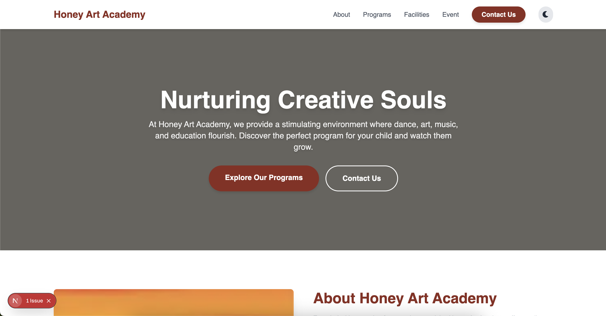
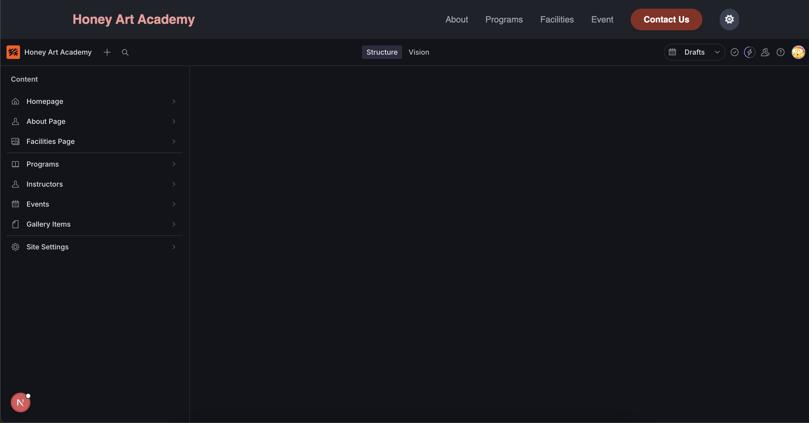

# Honey Art Academy

<table>
  <tr>
    <td valign="top"></td>
    <td valign="top"></td>
  </tr>
</table>

<div align="center">

[](https://opensource.org/licenses/MIT)
[](https://nextjs.org/)
[](https://tailwindcss.com/)
[](https://www.sanity.io/)
[](https://vercel.com/)

</div>

---

This project is a modern, responsive website for the **Honey Art Academy**, designed to showcase its programs, facilities, and student artwork. It serves as a central hub for prospective students and parents to find information about the academy, view the gallery, and get in touch with the staff. The website is built with a headless CMS for easy content management.

## ✨ Features

- **Dynamic Content Management**: Powered by Sanity.io, allowing administrators to easily update programs, gallery items, events, and instructor information without touching any code.
- **Detailed Program Pages**: Each art program has its own dedicated page with comprehensive details, schedules, and instructor information.
- **Artwork Gallery**: A beautiful gallery to showcase student artwork, with individual pages for each piece providing more detail.
- **Dark/Light Mode**: A theme toggler for a comfortable viewing experience in any lighting condition.
- **Responsive Design**: Fully responsive layout ensures a seamless experience on desktops, tablets, and mobile devices.

---

## 🛠️ Tech Stack

- **Framework**: [Next.js](https://nextjs.org/)
- **Styling**: [Tailwind CSS](https://tailwindcss.com/)
- **CMS**: [Sanity.io](https://www.sanity.io/)
- **Deployment**: [Vercel](https://vercel.com/)

---

## 🚀 Getting Started

This is a [Next.js](https://nextjs.org/) project bootstrapped with [`create-next-app`](https://github.com/vercel/next.js/tree/canary/packages/create-next-app).

### Prerequisites

- Node.js >= 18.18.0
- npm, yarn, or pnpm

### Installation

1.  Clone the repository:
    ```bash
    git clone [https://github.com/steven-ou/honey_art_academy.git](https://github.com/steven-ou/honey_art_academy.git)
    ```
2.  Navigate to the project directory:
    ```bash
    cd honey-academy
    ```
3.  Install the dependencies:
    ```bash
    npm install
    ```

### Running the Development Server

To run the development server:

```bash
npm run dev
Open http://localhost:3000 with your browser to see the result.

License
This project is licensed under the MIT License - see the LICENSE file for details.
```
